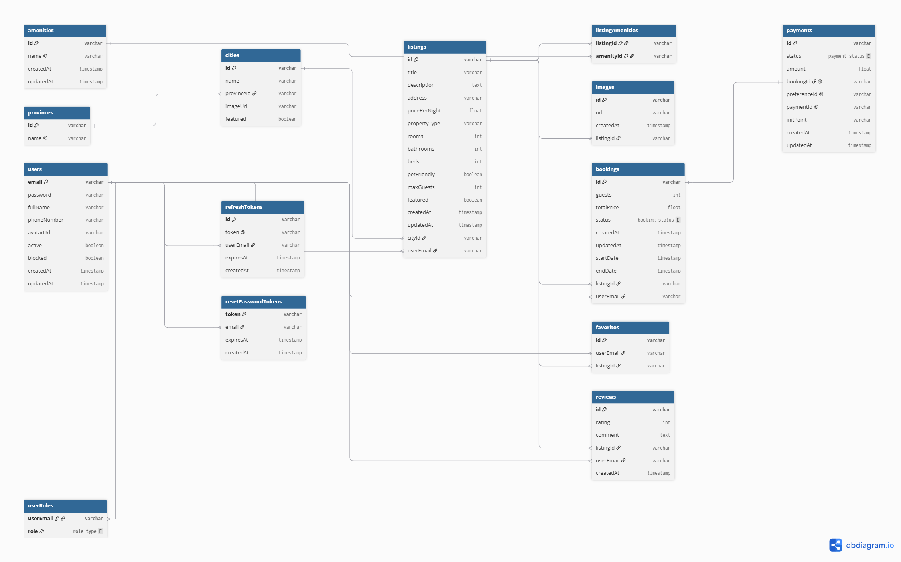

# Propuesta TP DSW

## Grupo

### Integrantes
- 48318 - Merino, Federico

### Repositorios
- [Frontend App](https://github.com/fedemerino/dsw-frontend)  
- [Backend App](https://github.com/fedemerino/dsw-backend)  

---

## Tema

### Descripción

Aplicación web que permite a usuarios publicar alojamientos para alquiler temporario y a otros usuarios realizar reservas. Se podrán buscar alojamientos según fecha, localidad y cantidad de huéspedes, ver detalles de cada publicación, dejar reseñas, y gestionar reservas.

### Modelo

## Alcance Funcional

### Alcance Mínimo (Regularidad)

| Req              | Detalle |
|------------------|---------|
| CRUD simple      | 1. CRUD Usuarios |
| CRUD dependiente | 1. CRUD Publicaciones (depende de Usuario, Localidad) 2. CRUD Imágenes (depende de Publicación) 3. CRUD Reservas (depende de Usuario y Publicación) 4. CRUD Reseñas (depende de Usuario y Publicación) |
| Listado + detalle| 1. Listado de publicaciones filtrado por localidad, fechas y cantidad de huéspedes 2. Detalle de cada publicación con imágenes, precio, descripción y reseñas |
| CUU / Epic       | 1. Registrarse en la plataforma — Un visitante completa el formulario de registro para obtener una cuenta y poder realizar reservas o publicar alojamientos 2. Iniciar sesión — Un usuario ingresa sus credenciales para acceder a su cuenta y operar en la plataforma 3. Publicar un alojamiento — Un anfitrión carga los datos, imágenes y precio de un alojamiento para que otros usuarios puedan encontrarlo y reservarlo 4. Buscar y reservar un alojamiento — Un huésped ingresa destino, fechas y cantidad de huéspedes, selecciona un resultado y confirma una reserva abonando a través de la plataforma 5. Editar o eliminar una publicación propia — Un anfitrión actualiza los datos o da de baja un alojamiento que ya no desea ofrecer |

---

### Alcance para Aprobación Directa

| Req     | Detalle |
|---------|---------|
| CRUDs   | CRUD completo de todas las entidades necesarias (Usuarios, Publicaciones, Reservas, Reseñas, Favoritos, Imágenes) |
| CUUs    | 1. Cancelar una reserva — Un huésped o anfitrión cancela una reserva existente; el sistema actualiza el estado y notifica a la otra parte 2. Reseñar un alojamiento — Un huésped que completó su estadía deja una calificación y comentario sobre el alojamiento para orientar a futuros huéspedes 3. Guardar un alojamiento en favoritos — Un huésped marca una publicación como favorita para encontrarla fácilmente en visitas futuras 4. Ver el historial de reservas — Un huésped consulta sus reservas pasadas y próximas para hacer seguimiento de sus estadías 5. Actualizar perfil de usuario — Un usuario modifica sus datos personales (nombre, foto, método de pago) para mantener su información al día |

---

### Alcance Adicional Voluntario

| Req     | Detalle |
|---------|---------|
| CUUs    | 1. Recuperar contraseña — Un usuario que olvidó su contraseña solicita un enlace de restablecimiento por email para recuperar el acceso a su cuenta 2. Recibir recordatorio de reserva — Un huésped recibe un email automático días antes de su check-in con los detalles de la reserva confirmada |
| Otros   | 1. Dashboard para anfitriones — Vista con métricas de sus publicaciones: reservas activas, ingresos y calificación promedio 2. Historial de actividad del anfitrión — Vista de todas las reservas recibidas, con filtros por estado (pendiente, confirmada, cancelada)

---

### Notas sobre cambios de alcance respecto a la propuesta original

- **CRUD Métodos de Pago**: se eliminó como entidad de negocio propia. En su lugar, cada reserva se asocia directamente a una entidad `Payment` que se gestiona a través de la integración con MercadoPago (Checkout Pro + webhook de confirmación) — una solución más realista que un CRUD manual de métodos de pago.
- **CRUD Provincias / CRUD Localidades**: acordado con el docente que quedan fuera del alcance de Aprobación Directa. Se mantienen como datos de referencia (seed) expuestos solo en modo lectura vía API, usados para geolocalizar las publicaciones y para los filtros de búsqueda.
